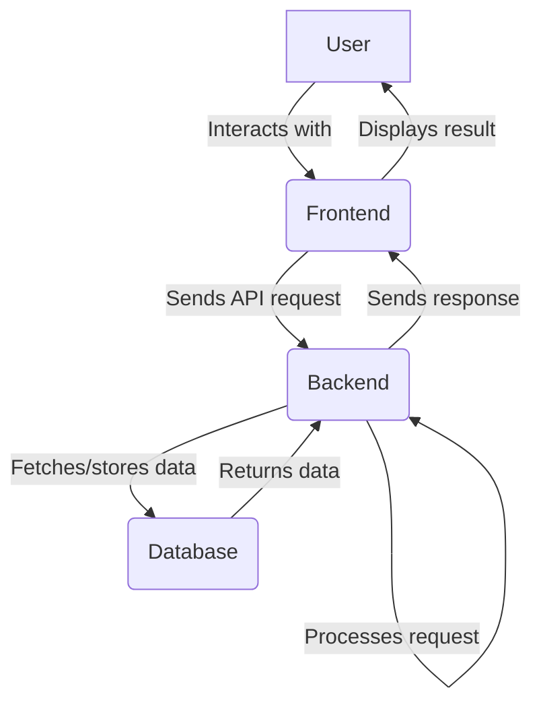

# Project Title

A brief and engaging description of your project, explaining what it does and who it's for.


## ✨ Features

A summary of the key features of your project.

| Feature                | Status      | Description                                     |
| ---------------------- | ----------- | ----------------------------------------------- |
| **Core Functionality** | ✅ Complete | The main feature of the project is fully functional. |
| **User Interface**     | 🚧 In-Progress | The UI is currently under development.          |
| **API Integration**    | ❌ Planned  | Integration with external APIs is planned.      |

## 🛠️ Technologies Used

A list of technologies, frameworks, and libraries used in the project.

-   **Frontend:** [e.g., React, Vue, Angular]
-   **Backend:** [e.g., Node.js, Python, Django]
-   **Database:** [e.g., PostgreSQL, MongoDB]
-   **Testing:** [e.g., Jest, Pytest]

## 🚀 Getting Started

Instructions on how to get a local copy of the project up and running.

### Prerequisites

List any software or tools that need to be installed before setting up the project.

-   [e.g., Node.js >= 14.x]
-   [e.g., Python >= 3.8]

### Installation

A step-by-step guide on how to install the project.

1.  **Clone the repository:**
    ```sh
    git clone https://github.com/your-username/your-project.git
    ```
2.  **Navigate to the project directory:**
    ```sh
    cd your-project
    ```
3.  **Install dependencies:**
    ```sh
    # For Node.js projects
    npm install

    # For Python projects
    pip install -r requirements.txt
    ```

## Usage

Provide examples of how to use your project. Include code blocks and screenshots if applicable.

### Example 1: Basic Usage

```python
# Import the necessary module
from src.main import awesome_function

# Call the function
result = awesome_function()
print(result)
```

### Example 2: Advanced Usage

```javascript
// A more complex example demonstrating advanced features.
const { anotherGreatFunction } = require('./src/utils');

anotherGreatFunction({
  param1: 'value1',
  param2: 'value2',
});
```

## 🏗️ Project Architecture

A diagram showing the high-level architecture or workflow of the project.



## 🤝 Contributing

We welcome contributions from the community! Please read our [CONTRIBUTING.md](CONTRIBUTING.md) for guidelines on how to get started.

## 📝 License

This project is licensed under the MIT License. See the [LICENSE](LICENSE) file for details.

## 📞 Contact

-   **Your Name:** [Your Name]
-   **Email:** [your-email@example.com]
-   **Project Link:** [https://github.com/your-username/your-project](https://github.com/your-username/your-project)
