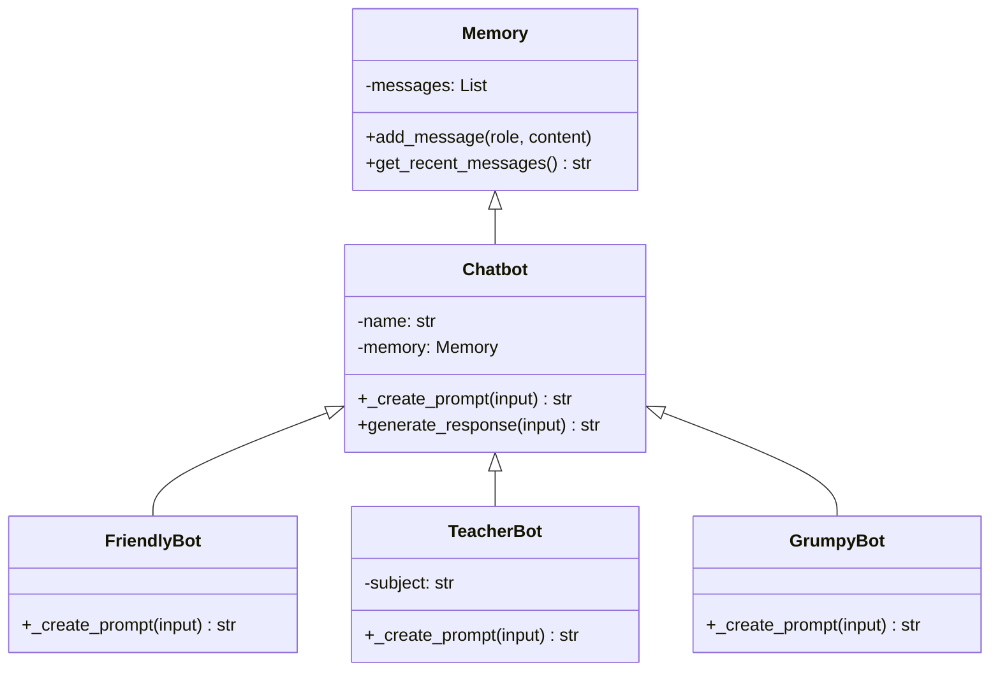

<div align="center">

# 🤖 Multi-Personality AI Chatbot

[](https://python.org)
[](https://streamlit.io)
[](https://groq.com)
[](LICENSE)

**A flexible AI chatbot with multiple personalities, contextual memory, and LLM integration.**

*Prompt engineering • OOP architecture • Real-time conversations • Web interface*

</div>

---

## 📋 Overview

An interactive AI chatbot demonstrating clean software architecture with multiple bot personalities, conversation memory, and LLM integration. Built with Python and Streamlit for an intuitive web experience.

---

## 🎭 Bot Personalities

<div align="center">

| Bot | Personality | Best For |
|:---:|-------------|----------|
| 😊 **Friendly Bot (Joy)** | Cheerful, casual, approachable | Casual conversations, entertainment |
| 📚 **Teacher Bot** | Expert instructor, customizable subject | Learning, educational Q&A |
| 😤 **Grumpy Bot** | Sarcastic, witty, still helpful | Humor, unique interactions |

</div>

---

## ✨ Features

| Feature | Description |
|---------|-------------|
| **🎭 Multiple Personalities** | Switch between different bot characters |
| **🧠 Memory System** | Maintains last 3 messages for context |
| **🌐 Web Interface** | Streamlit-based chat with sidebar controls |
| **📚 Customizable Teacher** | Set subject and instructor name |
| **⚡ Real-time Chat** | Smooth conversation with "thinking" indicators |
| **💻 CLI Support** | Optional command-line interface |

---

## 🏗️ Architecture


```mermaid
classDiagram
    class Memory {
        -messages: List
        +add_message(role, content)
        +get_recent_messages() str
    }

    class Chatbot {
        -name: str
        -memory: Memory
        +_create_prompt(input) str
        +generate_response(input) str
    }

    class FriendlyBot {
        +_create_prompt(input) str
    }

    class TeacherBot {
        -subject: str
        +_create_prompt(input) str
    }

    class GrumpyBot {
        +_create_prompt(input) str
    }

    Memory <|-- Chatbot
    Chatbot <|-- FriendlyBot
    Chatbot <|-- TeacherBot
    Chatbot <|-- GrumpyBot
```

---

## 🛠️ Tech Stack

| Component | Technology | Purpose |
|-----------|------------|---------|
| **Backend** |  | Core logic |
| **Web UI** |  | Browser interface |
| **LLM** |  | AI responses |
| **API Client** |  | Groq integration |

---

## 🚀 Quick Start

### Prerequisites

- Python 3.7+
- Groq API key ([Get one here](https://console.groq.com))

### Installation

```bash
# Clone the repository
git clone https://github.com/surbalo1/multi-personality-chatbot.git
cd multi-personality-chatbot

# Install dependencies
pip install streamlit openai

# Add your API key in utils.py
# API_KEY = "your_groq_api_key_here"
```

### Running the App

#### 🌐 Web Interface (Recommended)

```bash
streamlit run app.py
```

#### 💻 Command-Line Interface

```bash
python chatbot_logic.py
```

---

## 📁 Project Structure

```
multi-personality-chatbot/
├── 🌐 app.py             # Streamlit web interface
├── 🧠 chatbot_logic.py   # Core chatbot logic & personalities
├── 🔧 utils.py           # LLM integration & helpers
├── 📝 replacements.txt   # Text processing rules
└── 📄 README.md          # Documentation
```

---

## 🔧 How It Works

### 1️⃣ Memory System
Stores the last 3 messages to maintain conversation context:

```python
class Memory:
    def add_message(self, role: str, content: str):
        self.messages.append({'role': role, 'content': content})
        self.messages = self.messages[-3:]  # Keep only last 3
```

### 2️⃣ Base Chatbot Class
Shared functionality for all bot types:

```python
class Chatbot:
    def generate_response(self, user_input: str) -> str:
        self.memory.add_message("user", user_input)
        prompt = self._create_prompt(user_input)
        response = query_llm(prompt)
        self.memory.add_message("bot", response)
        return response
```

### 3️⃣ Specialized Personalities
Each bot overrides `_create_prompt()` for unique behavior:

```python
class FriendlyBot(Chatbot):
    def _create_prompt(self, user_input: str) -> str:
        return f"You are a super friendly chatbot! {history}\nUser: {user_input}"

class GrumpyBot(Chatbot):
    def _create_prompt(self, user_input: str) -> str:
        return f"You are always annoyed and sarcastic. {history}\nUser: {user_input}"
```

---

## 🎮 Usage

### Web Interface

1. Open the app in your browser
2. **Select a bot personality** in the sidebar
3. For Teacher Bot, set **subject** and **instructor name**
4. Click **Start Chat** to begin
5. Use **Reset Conversation** to switch personalities

### Command-Line

```
$ python chatbot_logic.py

Choose your chatbot:
1. Friendly Bot
2. Teacher Bot
3. Grumpy Bot
Enter 1, 2, or 3: 2

What subject should I teach? Embedded Systems
Mr. Incredible: Hello! How can I help you today?

You: What is I2C?
Mr. Incredible: I2C (Inter-Integrated Circuit) is a synchronous...
```

---

## 🔐 Security Notes

> ⚠️ **Important:** Keep your API key private!

| Environment | Recommendation |
|-------------|----------------|
| Development | Store in `utils.py` (gitignored) |
| Production | Use environment variables |
| Public repos | Never commit API keys |

---

## 💡 Skills Demonstrated

This project highlights:

- **🐍 Python & OOP** - Clean class hierarchy with inheritance
- **🎯 Prompt Engineering** - Modular personality design
- **🔌 LLM Integration** - Groq API with Llama 3.3 70B
- **🏗️ Software Architecture** - Base class + subclasses pattern
- **🧠 State Management** - Conversation memory handling

---

## 🤝 Contributing

Pull requests are welcome! Feel free to add new personalities or features.

---

## 📄 License

Educational project for learning and portfolio demonstration.

---

<div align="center">

**Built with ❤️ using Python, Streamlit, and Groq API**

[](https://github.com/surbalo1/multi-personality-chatbot)

</div>